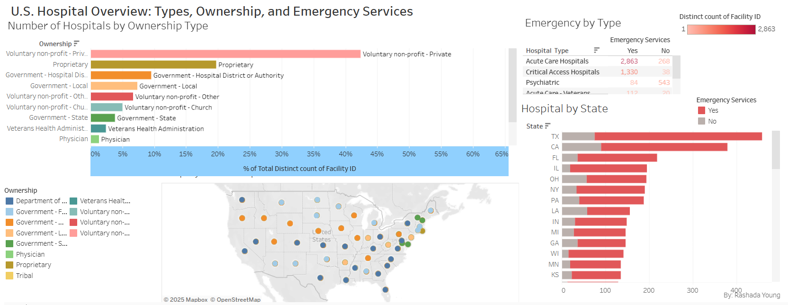

# U.S. Hospital Resource Dashboard

This project uses CMS Hospital General Information data to analyze hospital types, ownership models, and emergency services across U.S. states.

## Tools Used
- Tableau Public
- Excel

## Dashbaord
[View Interactive Dashboard on Tableau Public](https://public.tableau.com/app/profile/rashada.young/viz/HospitalResourceDashboard/Dashboard1)

## Features
- Map view of hospital locations by ownership
- State-level counts of hospitals
- Emergency service availability heatmap
- Interactive filters by type, location, and ownership

## Files
- 'hospital_info_cleaned.csv' - cleaned dataset 
- Screenshot of dashboard (optional for preview)

## Key Insights
- Nonprofit hospitals dominate in most states
- Certain states lack emergency services in rural regions
- Ownership models correlate with hospital type
 
